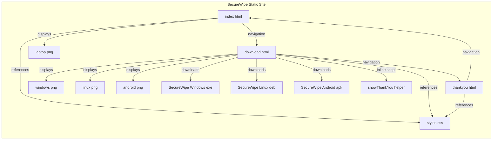
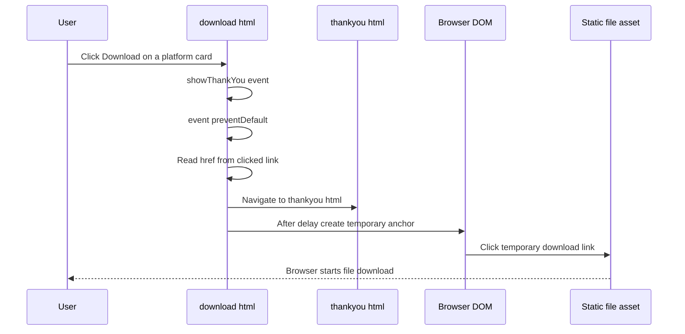

## Overview

SecureWipe is delivered as a three-page static website that runs entirely in the browser. The user journey starts on `index.html`, moves to `download.html` for operating-system-specific package selection, and ends on `thankyou.html` after a download is initiated.

The retrieved repository content shows direct HTML documents, a shared stylesheet reference, and one inline JavaScript helper in `download.html`. There are no server-rendered templates, API calls, build-tool bootstrap files, or framework initialization code visible in the surfaced files.

## Architecture Overview

The runtime boundary is the browser itself. Each page is a standalone HTML entry point that the browser renders directly, and the only executable behavior surfaced in the repository is the inline `showThankYou(event)` function inside `download.html`.

## Component Structure

### Browser Delivered Entry Points

#### `index.html`

*`index.html`*

`index.html` is the landing page and primary marketing entry point. It presents the product headline, a brief value statement, a download call to action, and a feature list that describes the product as a secure wipe tool for asset recycling.

| Page Section | Responsibility |
| --- | --- |
| Navbar | Provides site navigation to `#features` and `download.html` |
| Hero section | Introduces SecureWipe and routes users toward the download page |
| Features section | Summarizes the product claims shown on the landing page |
| Footer | Displays the site branding and compliance text |

The page links to `styles.css` for shared presentation, and it uses `laptop.png` for the hero illustration.

#### `download.html`

*`download.html`*

`download.html` is the software distribution page. It presents three download cards for Windows, Linux, and Android, each wired to a static file under `files/`, and each download control calls the inline `showThankYou(event)` helper.

| Page Section | Responsibility |
| --- | --- |
| Navbar | Provides navigation back to `index.html` and to the download page itself |
| Download section | Presents platform-specific download options |
| Download cards | Expose direct file targets for Windows, Linux, and Android |
| Footer | Shows the site branding and security text |

The page references `styles.css` and displays `windows.png`, `linux.png`, and `android.png` as platform artwork.

#### Inline JavaScript Helper

##### `showThankYou(event)`

download.html includes a Features navigation link with href="#features", but the page body does not define an element with id="features". That link has no in-page target on download.html.

*`download.html`*

`showThankYou(event)` is the only surfaced client-side behavior in the repository. It intercepts the default link action, reads the file URL from the clicked anchor, redirects the browser to `thankyou.html`, and then triggers the original file download from a temporary anchor element after a 500 millisecond delay.

| Method | Description |
| --- | --- |
| `showThankYou` | Prevents the default download navigation, redirects to `thankyou.html`, and initiates the selected file download in the background |

Behavior flow:

1. Calls `event.preventDefault()` to suppress the anchor’s default action.
2. Reads the `href` from `event.currentTarget`.
3. Sets `window.location.href` to `thankyou.html`.
4. Creates a temporary `<a>` element.
5. Assigns the downloaded file URL to the temporary link.
6. Clicks the temporary link to start the file transfer.
7. Removes the temporary link from the document.

#### `thankyou.html`

*`thankyou.html`*

`thankyou.html` is the post-download confirmation page. It acknowledges the user action, states that the download has started, and offers a single return path to `index.html`.

| Page Section | Responsibility |
| --- | --- |
| Navbar | Preserves the shared site navigation |
| Thank You section | Confirms the download initiation |
| Footer | Repeats the site branding and compliance text |

The page also references `styles.css`, keeping the shared visual structure aligned with the other entry points.

### Shared Stylesheet

#### `styles.css`

*`styles.css`*

`styles.css` is linked from all three HTML documents and serves as the common styling dependency for the site. Its contents are not part of the retrieved material, so only the shared reference can be documented here.

| Referenced By | Role |
| --- | --- |
| `index.html` | Shared page styling |
| `download.html` | Shared page styling |
| `thankyou.html` | Shared page styling |

### Static Asset Dependencies

The repository links the following static assets directly from HTML:

| Asset | Used By | Purpose |
| --- | --- | --- |
| `laptop.png` | `index.html` | Hero illustration |
| `windows.png` | `download.html` | Windows download card icon |
| `linux.png` | `download.html` | Linux download card icon |
| `android.png` | `download.html` | Android download card icon |
|  | `download.html` | Windows download target |
|  | `download.html` | Linux download target |
|  | `download.html` | Android download target |

## Runtime Boundaries

The retrieved files define a browser-only delivery model.

- Page composition is static HTML served as direct entry points.
- Styling is centralized through the shared `styles.css` reference.
- The only executed logic is the inline `showThankYou(event)` function in `download.html`.
- Navigation is handled with standard links and `window.location.href`.
- Download initiation is handled with a temporary anchor element created in the DOM.

The visible implementation does not include server-rendered templates, request handlers, client API calls, build output wiring, or framework bootstrap code. The site’s behavior is therefore bounded to what the browser can render and execute from the retrieved HTML and linked static assets.

## User Flow and Delivery Path

### Download Initiation and Confirmation

The download page performs two user-visible actions in sequence: it shows the confirmation page and then starts the file transfer. The download target remains a static file URL, so the browser handles the actual transfer directly.

## Page State and Navigation

The site’s state is page-based rather than application-state driven.

| State | Visible Page | Entry Trigger | Exit Trigger |
| --- | --- | --- | --- |
| Landing | `index.html` | Direct load or click from `thankyou.html` | Click `Download` in the hero or navbar |
| Download Selection | `download.html` | Click `Download` from `index.html` or navbar navigation | Click one of the platform download links |
| Confirmation | `thankyou.html` | `showThankYou(event)` redirect | Click `Return to Home` or the logo |

`download.html` also marks the `Download` navigation item with `class="active"`, making the current page visible in the shared header.

## Error Handling

The surfaced client-side control flow uses `event.preventDefault()` in `showThankYou(event)` to stop the anchor’s default immediate navigation. That lets the page show `thankyou.html` before the file download is triggered.

| Control Point | Behavior |
| --- | --- |
| `event.preventDefault()` | Suppresses the link’s built-in action |
| `window.location.href = "thankyou.html"` | Moves the user to the confirmation page |
| Temporary anchor click | Starts the file download from the original `href` |

## Integration Points

This section is limited to static page-to-page and asset-to-page integration.

- `index.html` links into `download.html`.
- `download.html` links back to `index.html` and forward to `thankyou.html`.
- `thankyou.html` returns users to `index.html`.
- All three pages depend on `styles.css`.
- `download.html` integrates with the static files under `files/`.

## Testing Considerations

The implementation supports a small set of direct browser checks.

| Scenario | Expected Result |
| --- | --- |
| Load `index.html` | Landing page renders with hero content, features, and download CTA |
| Click `Download` from `index.html` | Browser opens `download.html` |
| Click a platform download button | Browser navigates to `thankyou.html` and initiates the matching file download |
| Click `Return to Home` on `thankyou.html` | Browser returns to `index.html` |
| Load `download.html` | Three platform cards and the active download navigation state appear |

## Key Classes Reference

| Class | Responsibility |
| --- | --- |
| `index.html` | Landing page entry point with hero content, features, and download navigation |
| `download.html` | Download selection entry point with platform cards and inline download helper |
| `thankyou.html` | Post-download confirmation entry point with return navigation |
| `styles.css` | Shared stylesheet referenced by all three pages |
